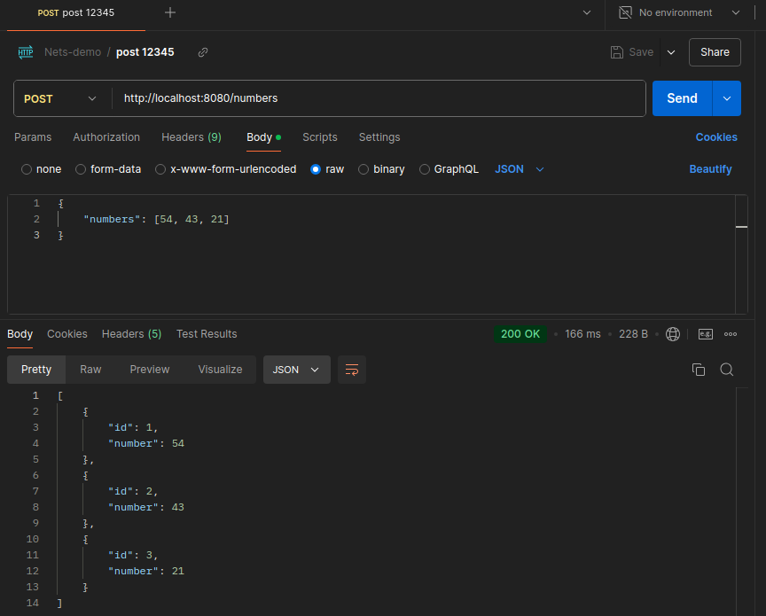
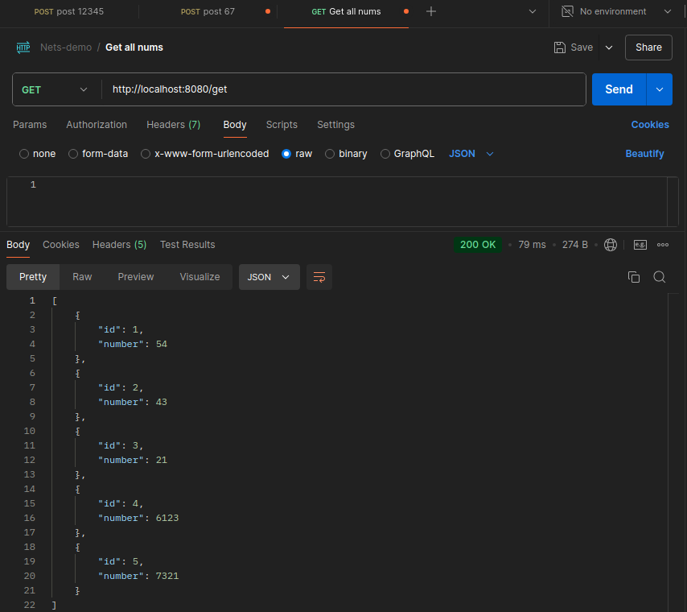
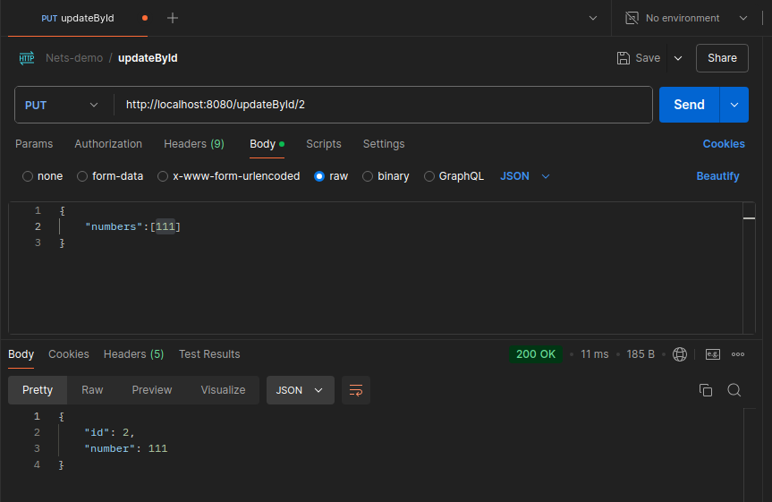
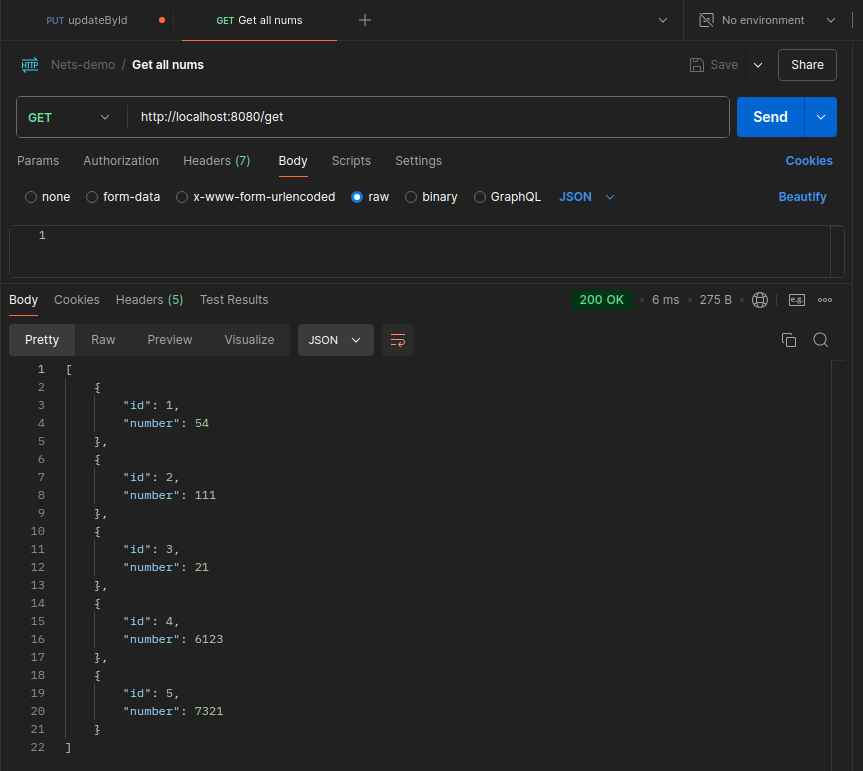

# Nets Demo Project

This is a simple RESTful web service application built using Spring Boot. It provides endpoints for managing lists of numbers, 
storing them in an H2 in-memory database, and includes unit and integration tests to ensure functionality and quality.

Task description for given work can be accessed [here.](springboot_task.md)

## Features

- CRUD operations on lists of numbers via REST endpoints.
- H2 in-memory storage.
- Layered architecture following Domain-Driven Design principles.
- Unit and integration tests using JUnit, Mockito, and Spring Boot Test.

## Table of Contents
- [Prerequisites](#Prerequisites)
- [Installation](#Installation)
- [API Endpoints](#API-Endpoints)
- [Testing](#Testing)
- [Project Structure](#project-structure)
- [Technologies Used](#technologies-used)

### Prerequisites

To run this project, you need:
- Java 17 or higher
- Maven 3.6 or higher
- Spring Boot 3.3.5 or higher

### Installation

1. Clone the repository:
   ```bash
   git clone https://github.com/IngvarLeerimaa/Nets-demo
   cd Nets-demo
   ```

2. Build the project using Maven:
   ```bash
   mvn clean install
   ```

3. Run the application:
   ```bash
   mvn spring-boot:run
   ```
The application will start on `http://localhost:8080`.

Port can be changed by navigating to `src/main/resources/application.properties` 
and inserting your desired port number `server.port=<Port_Number>`.

The application uses an H2 in-memory database. 

To access the H2 ui, navigate to `http://localhost:8080/h2-ui/`.

## API Endpoints

- **POST /numbers** - Stores each number in the database as a new entity.
  - Request Body:
    ```json
    {
      "numbers": [54, 43, 21]
    }
    ```
    - **Response**: JSON object of the saved Nums entity.
    - **Status Codes**:
      - `200 OK`: Successfully added numbers.
      - `400 BAD REQUEST`: Invalid request body.
      - `500 INTERNAL SERVER ERROR`: An error occurred while saving the numbers.
      

- **GET /get**
    - Retrieve all lists of numbers.
    - **Response**: JSON array of all `Nums` entities.
    - **Status Codes**:
      - `200 OK`: Successfully retrieved numbers.
      - `204 NO CONTENT`: No numbers found.
      - `500 INTERNAL SERVER ERROR`: An error occurred while fetching numbers.


- **PUT /updateById/{id}** - Update an existing list of numbers by ID.
  - Request Body:
    ```json
    {
      "numbers": [111]
    }
    ```
  - **Response**: JSON object of the updated Nums entity.
      - **Status Codes**:
        - `200 OK`: Successfully updated numbers.
        - `404 NOT FOUND`: ID not found.
        - `400 BAD REQUEST`: Invalid request body.
        - `500 INTERNAL SERVER ERROR`: An error occurred while updating the numbers.
        
        

- **DELETE /deleteNumById/{id}** - Delete a list of numbers by ID.
  - **Path Variable**: id - ID of the Nums entity to delete.
  - **Status Codes:**
    - `200 OK:` Successfully deleted numbers.
    - `404 NOT FOUND`: ID not found.
    - `500 INTERNAL SERVER ERROR`: An error occurred while deleting the numbers.


## Testing

The project includes unit and integration tests.

- **Run all tests**:
  ```bash 
    mvn test
  ```

The tests include:
- **Unit Tests**: Testing each layer of the application with Mockito.
- **Integration Tests**: Testing the overall behavior of the application, including database interactions.

## Project Structure

```plaintext
Nets-demo/
├── src/
│   ├── main/
│   │   ├── java/
│   │   │   └── com/example/nets_demo/
│   │   │       ├── controller/
│   │   │       │   └── NumController.java
│   │   │       ├── model/
│   │   │       │   └── Nums.java
│   │   │       ├── repo/
│   │   │       │   └── NumRepo.java
│   │   │       └── NetsDemoApplication.java
│   │   └── resources/
│   │       └── application.properties
│   └── test/
│       └── java/
│           └── com/example/nets_demo/
│               ├── controller/
│               │   ├── NumControllerTest.java
│               │   └── NumControllerIntegrationTest.java
│               └── NetsDemoApplicationTests.java
├── pom.xml
└── README.md
```

## Technologies Used
- Java 17
- Spring Boot
- Spring Data JPA
- H2 Database
- JUnit and Mockito for testing